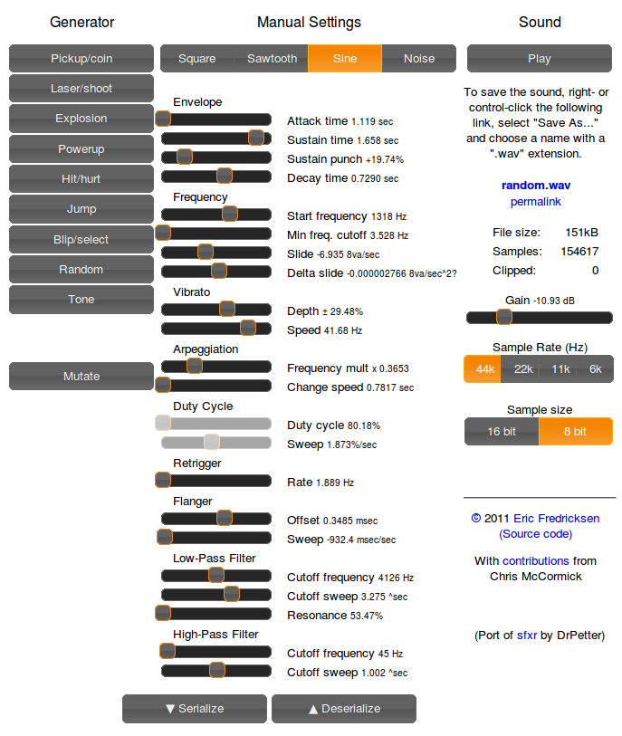
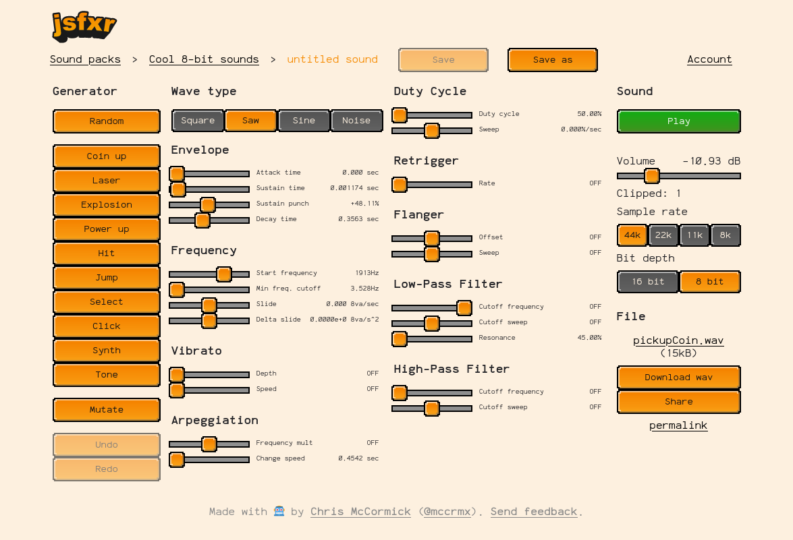

Tremowaves Sound Effects Generator

A powerful and easy-to-use game sound effects generator, customized by Tremowaves.

App 👉 https://tremowaves.com

[About](#about) | [Use as a library](#library) | [Tremowaves Pro](#tremowaves-pro)

# About

A customized version of [sfxr](http://www.drpetter.se/project_sfxr.html) by Tremowaves, based on the original HTML5 port by Eric Fredricksen and maintained by Chris McCormick.



# Library

You can use the Tremowaves sound generator library to create and play sounds in your JavaScript game code.

## Node

Install it:

```
npm i tremowaves-sfx
```

Require it:

```
const sfxr = require("tremowaves-sfx").sfxr;
```

See [API](#API) below for usage examples.

## Browser

Include the scripts in your page:

```
<script src="https://tremowaves.com/riffwave.js"></script>
<script src="https://tremowaves.com/sfxr.js"></script>
```

You can then directly use the `sfxr` namespace without requiring it.

## API

Generate a sound effect using a preset algorithm and play it using webaudio API.

```javascript
const sfxr = require("tremowaves-sfx").sfxr;

const preset = "pickupCoin";
const sound = sfxr.generate(preset);

sfxr.play(sound);
```

Available presets are `pickupCoin`, `laserShoot`, `explosion`, `powerUp`, `hitHurt`, `jump`, `blipSelect`, `synth`, `tone`, `click`, and `random`.

You can also use the interface at https://tremowaves.com to find the sound you want and then use the sound definition.
Click the "serialize" button and copy the JSON code for the sound you want.
You will get a datastructure that you can use like this:

```javascript
var sound = {
  "oldParams": true,
  "wave_type": 1,
  "p_env_attack": 0,
  "p_env_sustain": 0.31718502829007483,
  "p_env_punch": 0,
  "p_env_decay": 0.2718540993592685,
  "p_base_freq": 0.2612<F2>6191208337196,
  "p_freq_limit": 0,
  "p_freq_ramp": 0.43787689856926615,
  "p_freq_dramp": 0,
  "p_vib_strength": 0,
  "p_vib_speed": 0,
  "p_arp_mod": 0,
  "p_arp_speed": 0,
  "p_duty": 1,
  "p_duty_ramp": 0,
  "p_repeat_speed": 0.7558565452384385,
  "p_pha_offset": 0,
  "p_pha_ramp": 0,
  "p_lpf_freq": 1,
  "p_lpf_ramp": 0,
  "p_lpf_resonance": 0,
  "p_hpf_freq": 0,
  "p_hpf_ramp": 0,
  "sound_vol": 0.25,
  "sample_rate": 44100,
  "sample_size": 8
};

var a = sfxr.toAudio(sound);
a.play();
```

You can also use the short URL compressed version of the sound:

```javascript
var a = sfxr.toAudio("5EoyNVSymuxD8s7HP1ixqdaCn5uVGEgwQ3kJBR7bSoApFQzm7E4zZPW2EcXm3jmNdTtTPeDuvwjY8z4exqaXz3NGBHRKBx3igYfBBMRBxDALhBSvzkF6VE2Pv");
a.play();
```

You can also access an array of samples.
By default the buffer contains audio rendered at a sample rate of `44100`.

```
var buffer = sfxr.toBuffer(sound);
console.log(buffer);
```

Additionally you can get a dataURI for a wav file of the sound:

```
var a = sfxr.toWave(sound);
console.log(a.dataURI);
```

You can convert between the base58 short-url encoded format and JSON using `b58encode` and `b58decode`:

```
var b58string = sfxr.b58encode(sound);
var sound = sfxr.b58decode(b58string);
```

You can also access the lower level classes `SoundEffect` and `Params` if you need to.
This can be useful for caching the internal representation for efficiency, or mutating the sound with `params.mutate()`.

# Tremowaves Pro

A [Pro version](https://pro.tremowaves.com/) is available with enhanced features like the ability to save sounds to packs and download a zip file of all wavs.

[](https://pro.tremowaves.com)

# Links

* Application:  https://tremowaves.com/
* Source code:  https://github.com/tremowaves/tremowaves-sfx/

# Thanks

* Dr. Petter for inventing sfxr
* Eric Fredricksen for creating the original HTML5 port
* Chris McCormick for maintaining the original project
* riffwave.js: http://www.codebase.es/riffwave/
* jquery-ui:   http://jqueryui.com/

# License

This project is based on the original jsfxr project which is licensed under the MIT License.
Copyright (c) 2024 Tremowaves. All rights reserved.
